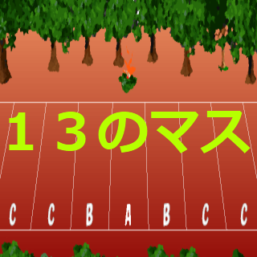

# 歴史

- 2011/09/10 ゲームエンジンに [enchant.js](https://ja.wikipedia.org/wiki/Enchant.js) を使い、原型となるゲームを作り始めた。当時の名前は「13のマス」

- 2012/01/26 9leap.net（現在は閉鎖）にて公開

～6年動きなし～

- 2018/09/21 Unityでのリメイク開始
- 2019/12/14 オフライン対戦の実装開始
- 2020/07/11 タイトルに13という数字を使うのは良くなさそうなので「ここコイン」に変更
- 2021/06/27 オンライン対戦の実装開始
- 2021/08/15 [unityroom](https://unityroom.com/games/kokocoin)にて機能制限付きで公開
- 2021/09/04 縦持ち対応
- 2021/09/26 広告の実装開始
- 2022/01/09 ローカライズ実装開始
- 2023// 公開（予定）
